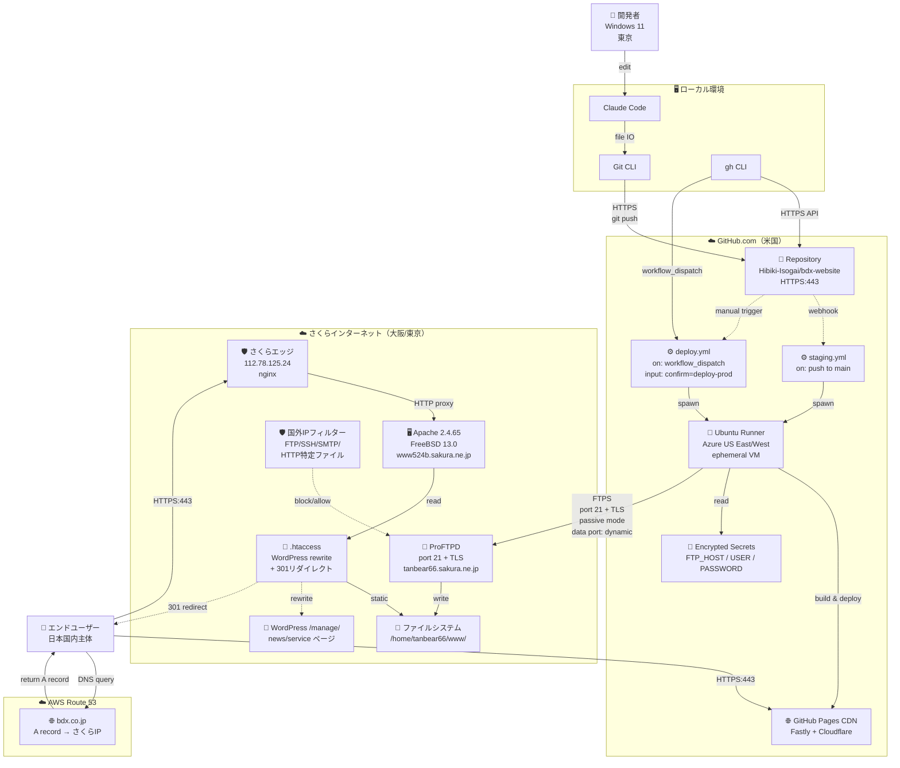
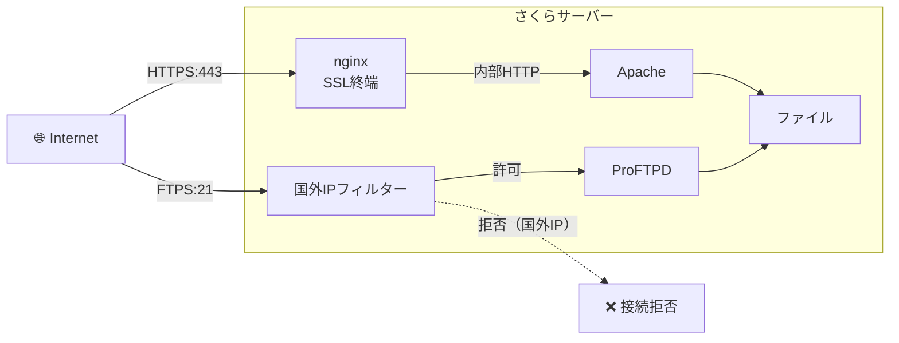

# アーキテクチャ構成図（詳細版）

> bdx-website のネットワーク経路・接続詳細を含むアーキテクチャ図。
> リソース概要は [overview.md](overview.md) 参照。
> 最終更新: 2026-04-28

---

## 全体ネットワーク構成



---

## ネットワーク経路詳細

### 1. 開発者 → GitHub（ソースコード送信）

```
開発者 PC（東京）
  ↓ HTTPS (port 443)
  ↓ TLS 1.3
  ↓ Git protocol over HTTPS
GitHub.com (US East)
```

| 項目 | 値 |
|------|-----|
| プロトコル | HTTPS |
| ポート | 443 |
| 認証 | Personal Access Token / OAuth |
| 暗号化 | TLS 1.3 |

### 2. GitHub Actions → さくらサーバー（FTPSデプロイ）

```
GitHub Actions Runner（Azure US East）
  ↓ FTPS (port 21 + TLS)
  ↓ Explicit FTPS (AUTH SSL)
  ↓ Passive Mode（データチャネル: dynamic high port）
  ↓ TLS 1.2 (sakura側の上限)
さくらインターネット ProFTPD
（大阪 or 東京DC）
```

| 項目 | 値 |
|------|-----|
| プロトコル | FTPS（Explicit FTP over TLS） |
| 制御チャネル | port 21 |
| データチャネル | passive mode、サーバ側ランダム高ポート |
| 認証 | Basic Auth（FTP_USER + FTP_PASSWORD） |
| 暗号化 | TLS 1.2 |
| クライアント | lftp（GitHub Actions Runner 上） |
| サーバ証明書検証 | 無効（`set ssl:verify-certificate no`） |

#### lftp 実行コマンド（deploy.yml）

```bash
lftp -u "$FTP_USER","$FTP_PASSWORD" "$FTP_HOST" <<'SCRIPT'
set ssl:verify-certificate no
set ftp:ssl-allow yes
set ftp:ssl-protect-data yes
set net:timeout 30
set net:max-retries 3
mirror --reverse --overwrite --verbose ./site/recruitment-graduate/ www/recruitment-graduate/
mkdir -p www/css/common/
put ./site/css/common/animations.css -o www/css/common/animations.css
mkdir -p www/scripts/common/
put ./site/scripts/common/scroll-reveal.js -o www/scripts/common/scroll-reveal.js
quit
SCRIPT
```

### 3. エンドユーザー → 本番サイト（HTTPS閲覧）

```
ユーザー（日本国内）
  ↓ DNS query
AWS Route 53（bdx.co.jp）
  ↓ A record: 112.78.125.24
ユーザー
  ↓ HTTPS (port 443)
  ↓ TLS 1.3
  ↓ HTTP/1.1 or HTTP/2
さくらエッジ nginx（SSL終端）
  ↓ HTTP（内部、平文）
Apache 2.4.65（mod_rewrite）
  ↓ .htaccess 評価
  ├─ recruitment-graduate/* → 静的HTML返却
  ├─ news/* → /manage/index.php（WordPress）
  ├─ service/* → /manage/index.php（WordPress）
  ├─ dx-training-* → 301 redirect to contents.bdx.co.jp
  └─ recruitment-experienced → 301 redirect to contents.bdx.co.jp
```

| 項目 | 値 |
|------|-----|
| サーバIP | `112.78.125.24` |
| ホスト名 | `www524b.sakura.ne.jp`（内部）/ `tanbear66.sakura.ne.jp`（FTP） |
| OS | FreeBSD 13.0-RELEASE-p14 amd64 |
| Webサーバ | nginx（前段、SSL終端）+ Apache 2.4.65（バックエンド） |
| ストレージ容量 | 600 GB（使用 454 MB） |

### 4. エンドユーザー → ステージング

```
ユーザー
  ↓ HTTPS (port 443)
GitHub Pages CDN（Fastly + Cloudflare）
  ↓
hibiki-isogai.github.io/bdx-website/
```

---

## セキュリティレイヤー



### 国外IPフィルターの動作

| 対象プロトコル | デフォルト | 影響 |
|------------|-----------|------|
| FTP/SFTP | 制限する | GitHub Actions（米国IP）からの FTPS 接続が拒否される |
| SSH | 制限する | 国外からのSSH接続が拒否される |
| SMTP | 制限する | 国外からのメール送信が拒否される |
| HTTP/HTTPS | 制限しない（ファイル単位設定） | サイト閲覧は影響なし |

**運用ルール**: デプロイ時のみ一時的に「無効」にして、終了後すぐ「有効」に戻す。

### .htaccess によるリダイレクト・リライト

```
[/home/tanbear66/www/.htaccess の主要ルール]

<IfModule mod_rewrite.c>
RewriteEngine On

# 旧コンテンツの contents.bdx.co.jp への301リダイレクト
RewriteRule ^dx-training-digest$ https://www.contents.bdx.co.jp/dx-training-digest [R=301,L]
RewriteRule ^dx-training-sample$ https://www.contents.bdx.co.jp/dx-training-sample [R=301,L]
RewriteRule ^dxtraining-contact$ https://www.contents.bdx.co.jp/dxtraining-contact [R=301,L]
RewriteRule ^master-dx-training-deliver$ https://www.contents.bdx.co.jp/master-dx-training-deliver [R=301,L]
RewriteRule ^iyotetsu-dx-training-deliver$ https://www.contents.bdx.co.jp/iyotetsu-dx-training-deliver [R=301,L]
RewriteRule ^obco-dx-training-deliver$ https://www.contents.bdx.co.jp/obco-dx-training-deliver [R=301,L]
RewriteRule ^rpat-dx-training-deliver$ https://www.contents.bdx.co.jp/rpat-dx-training-deliver [R=301,L]
RewriteRule ^recruitment-experienced$ https://www.contents.bdx.co.jp/recruitment-experienced [R=301,L]
# ※ 旧 recruitment-graduate のリダイレクトは 2026-04-28 に削除済み
</IfModule>

<IfModule mod_rewrite.c>
# WordPress (/manage/)
RewriteEngine On
RewriteBase /manage/
RewriteRule ^index\.php$ - [L]
RewriteCond %{REQUEST_FILENAME} !-f
RewriteCond %{REQUEST_FILENAME} !-d

# news 配下を /manage/index.php で WordPress 表示
RewriteCond %{REQUEST_URI} ^/news(/.*)?$
RewriteRule . /manage/index.php [L]

# service 配下を /manage/index.php で WordPress 表示
RewriteCond %{REQUEST_URI} ^/service(/.*)?$
RewriteRule . /manage/index.php [L]
</IfModule>
```

---

## ファイル構造（さくらサーバー側）

```
/home/tanbear66/                  ← FTP接続時の初期ディレクトリ
└── www/                          ← bdx.co.jp の WEB公開フォルダー
    ├── .htaccess                 ← リライトルール（重要）
    ├── .htpasswd                 ← Basic認証パスワード
    ├── index.html                ← トップページ
    ├── favicon.ico
    ├── about/                    ← 会社情報
    ├── contact/                  ← お問い合わせ
    ├── corporate/                ← コーポレート
    ├── css/
    │   └── common/
    │       ├── styles.css        ← 元からあるCSS
    │       └── animations.css    ← 28卒採用用に追加（NEW）
    ├── fonts/
    ├── images/
    ├── manage/                   ← WordPress 設置先
    ├── news/                     ← /manage/index.php で動的処理
    ├── online/
    ├── privacy/
    ├── recruitment/              ← 採用ハブ
    ├── recruitment-experienced/  ← 中途採用（contents.bdx.co.jp にリダイレクト）
    ├── recruitment-graduate/     ← 新卒採用（28卒リニューアル対象）
    │   ├── index.html
    │   ├── internship/index.html
    │   ├── career/index.html
    │   └── selection/index.html
    ├── scripts/
    │   └── common/
    │       ├── bundle.js
    │       ├── news.js
    │       └── scroll-reveal.js  ← 28卒採用用に追加（NEW）
    ├── security/
    ├── service/                  ← /manage/index.php で動的処理
    └── uploads/
```

---

## デプロイ範囲（重要）

`deploy.yml` は **限定範囲** のみアップロードする。**`site/` 全体をアップロードしない**。

| 対象 | 理由 |
|------|------|
| `site/recruitment-graduate/` | 今回のリニューアル対象（4ページ） |
| `site/css/common/animations.css` | 採用ページ用CSS（新規） |
| `site/scripts/common/scroll-reveal.js` | スクロールアニメJS（新規） |

**意図的に除外**しているもの:
- 動画ファイル（`site/images/home/mv.mp4` 8MB、`site/images/recruitment/mv.mp4` 4MB）
- 採用以外のHTMLページ（変更していないため上書きする必要がない）
- WordPress 関連（さくら側で管理）

---

## CI/CD ワークフロー詳細

### staging.yml（ステージング自動デプロイ）

| 項目 | 値 |
|------|-----|
| トリガー | `push` to `main` |
| ジョブ | GitHub Pages へ `site/` ディレクトリをデプロイ |
| 公開先 | https://hibiki-isogai.github.io/bdx-website/ |
| 所要時間 | 約 25〜30秒 |

### deploy.yml（本番デプロイ）

| 項目 | 値 |
|------|-----|
| トリガー | `workflow_dispatch`（手動） |
| 入力 | `confirm`（`deploy-prod` 必須） |
| 認可 | `if: github.event.inputs.confirm == 'deploy-prod'` |
| ステップ | (1) checkout (2) lftp install (3) FTPS deploy |
| 所要時間 | 約 35〜45秒 |
| 必要な事前作業 | さくら国外IPフィルターを「無効」にする |

---

## 関連ドキュメント

- [本番デプロイ手順](../operations/deploy-production.md)
- [概要アーキテクチャ図](overview.md)
- [.github/workflows/deploy.yml](../../.github/workflows/deploy.yml)
- [.github/workflows/staging.yml](../../.github/workflows/staging.yml)
