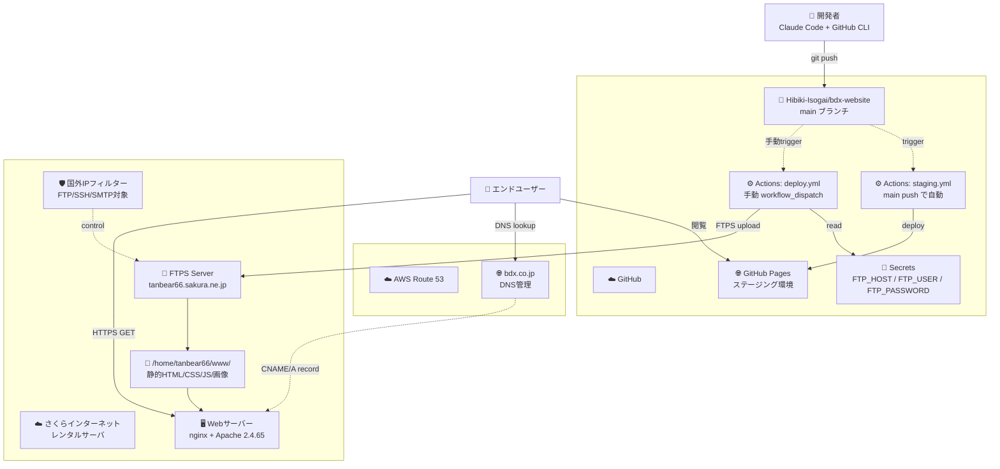

# アーキテクチャ構成図（概要版）

> bdx-website のリソース要素を概観する。詳細なネットワーク経路・接続情報は [detailed.md](detailed.md) 参照。
> 最終更新: 2026-04-28

---

## システム全体像

---

## 主要リソース一覧

### GitHub

| リソース | 用途 |
|----------|------|
| **リポジトリ** `Hibiki-Isogai/bdx-website` | サイトのソースコード管理 |
| **GitHub Actions: `staging.yml`** | main push で GitHub Pages へ自動デプロイ |
| **GitHub Actions: `deploy.yml`** | 手動実行で本番（さくら）へ FTPS デプロイ |
| **GitHub Pages** | ステージング環境（`hibiki-isogai.github.io/bdx-website/`） |
| **GitHub Secrets** | FTP接続情報（`FTP_HOST` / `FTP_USER` / `FTP_PASSWORD`） |

### さくらインターネット レンタルサーバ

| リソース | 用途 |
|----------|------|
| **サーバ** `tanbear66.sakura.ne.jp` | 本番サイトのホスティング |
| **ドキュメントルート** `/home/tanbear66/www/` | 公開ファイル配置先 |
| **Webサーバー** Apache 2.4.65 + 前段 nginx | HTTPS終端 + 静的ファイル配信 |
| **FTPS** ポート21 + TLS | デプロイ受信 |
| **国外IPフィルター** | セキュリティ機能（FTP/SSH/SMTP） |

### DNS

| リソース | 用途 |
|----------|------|
| **AWS Route 53** | `bdx.co.jp` のDNS管理（別チーム所管） |

### エンドユーザーアクセス先

| 環境 | URL |
|------|-----|
| 本番 | https://www.bdx.co.jp/ |
| ステージング | https://hibiki-isogai.github.io/bdx-website/ |

---

## 環境の役割分担

| 環境 | 用途 | デプロイ方法 | 確認担当 |
|------|------|------------|---------|
| **ローカル** | 開発・編集 | - | 開発者 |
| **ステージング** | 本番反映前のレビュー | main push で自動 | 開発者 + Owner |
| **本番** | エンドユーザー公開 | 手動承認 + workflow_dispatch | Owner |

---

## 関連ドキュメント

- [本番デプロイ手順](../operations/deploy-production.md)
- [詳細アーキテクチャ図（NW経路含む）](detailed.md)
