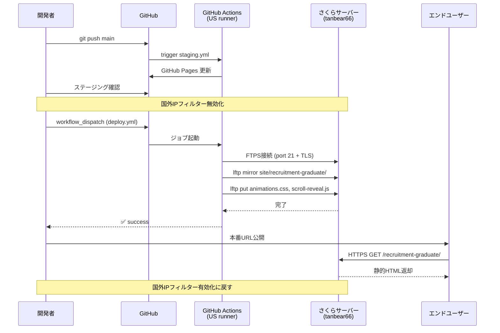

# 本番デプロイ手順

> bdx-website を本番環境（www.bdx.co.jp）へデプロイする手順
> 最終更新: 2026-04-28

---

## 概要

| 項目 | 値 |
|------|-----|
| 本番URL | https://www.bdx.co.jp/ |
| ホスティング | さくらインターネット レンタルサーバー（tanbear66.sakura.ne.jp） |
| デプロイ方式 | GitHub Actions → FTPS（lftp） |
| デプロイ範囲 | `site/recruitment-graduate/` + `site/css/common/animations.css` + `site/scripts/common/scroll-reveal.js` |
| 所要時間 | 約 1 分（GitHub Actions の実行時間） |

---

## デプロイの流れ

```
ローカル変更
  ↓
git push origin main
  ↓
ステージング自動デプロイ（GitHub Pages）
  ↓
ステージング確認
  ↓
さくらコンパネ: 国外IPフィルター無効化
  ↓
GitHub Actions: deploy.yml 手動実行
  ↓
本番反映確認
  ↓
さくらコンパネ: 国外IPフィルター有効化（戻す）
```

---

## デプロイ手順（詳細）

### Step 1: ステージングで動作確認

main ブランチに push すると GitHub Pages に自動デプロイされる。

ステージング URL（4ページ全て確認）:
- https://hibiki-isogai.github.io/bdx-website/recruitment-graduate/
- https://hibiki-isogai.github.io/bdx-website/recruitment-graduate/internship/
- https://hibiki-isogai.github.io/bdx-website/recruitment-graduate/career/
- https://hibiki-isogai.github.io/bdx-website/recruitment-graduate/selection/

PC・スマホ両方で確認。

### Step 2: 本番のバックアップ取得（任意）

リスクの高い変更時のみ実施。バックアップは `backups/YYYY-MM-DD-pre-deploy/` に配置してコミット。

```bash
mkdir -p backups/$(date +%Y-%m-%d)-pre-deploy/recruitment-graduate/{internship,career,selection,voices}

# 4ページ + トップページなどをcurlでバックアップ
curl -s -o backups/$(date +%Y-%m-%d)-pre-deploy/recruitment-graduate/index.html https://www.bdx.co.jp/recruitment-graduate/
curl -s -o backups/$(date +%Y-%m-%d)-pre-deploy/recruitment-graduate/internship/index.html https://www.bdx.co.jp/recruitment-graduate/internship/
curl -s -o backups/$(date +%Y-%m-%d)-pre-deploy/recruitment-graduate/career/index.html https://www.bdx.co.jp/recruitment-graduate/career/
curl -s -o backups/$(date +%Y-%m-%d)-pre-deploy/recruitment-graduate/selection/index.html https://www.bdx.co.jp/recruitment-graduate/selection/

git add backups/ && git commit -m "backup: pre-deploy snapshot" && git push origin main
```

### Step 3: さくらサーバーの国外IPフィルター無効化

> **重要**: GitHub Actions のランナーはアメリカ（Azure）にあるため、デフォルトの国外IPフィルター有効状態だと FTP 接続できない。

1. https://secure.sakura.ad.jp/rs/cp/ にログイン
2. 左メニュー → **セキュリティ**
3. **国外IPアドレスフィルター** を選択
4. アクセス制限設定 → **「無効（制限しない）」** にチェック
5. ページ下部の **保存** ボタンを押す

### Step 4: GitHub Actions で本番デプロイ実行

```bash
gh workflow run deploy.yml --field confirm=deploy-prod --repo Hibiki-Isogai/bdx-website
```

または GitHub の Web UI から:
1. https://github.com/Hibiki-Isogai/bdx-website/actions/workflows/deploy.yml
2. **Run workflow** ボタン
3. `confirm` 欄に **`deploy-prod`** と入力
4. **Run workflow** を押す

完了状態の確認:

```bash
gh run list --workflow=deploy.yml --repo Hibiki-Isogai/bdx-website --limit 1
```

`success` が表示されれば成功。約 30〜40 秒で完了する。

### Step 5: 本番反映確認

ブラウザで以下を確認（必ずスーパーリロード `Ctrl + Shift + R`）:

- https://www.bdx.co.jp/recruitment-graduate/
- https://www.bdx.co.jp/recruitment-graduate/internship/
- https://www.bdx.co.jp/recruitment-graduate/career/
- https://www.bdx.co.jp/recruitment-graduate/selection/
- https://www.bdx.co.jp/ （トップページ・フッターが壊れていないか）

CLI でファイルサイズによる確認:

```bash
curl -sI https://www.bdx.co.jp/recruitment-graduate/ | grep -E "Last-Modified|Content-Length"
```

`Last-Modified` がデプロイ直後の日時になっていれば反映済み。

### Step 6: 国外IPフィルターを有効に戻す（必須）

セキュリティのため必ず元に戻す。

1. https://secure.sakura.ad.jp/rs/cp/ → セキュリティ → 国外IPアドレスフィルター
2. アクセス制限設定 → **「有効（制限する）」** にチェック
3. **保存** を押す

---

## トラブルシューティング

### デプロイが失敗する

| エラー | 原因 | 対処 |
|--------|------|------|
| `Server sent FIN packet unexpectedly` | 国外IPフィルターが有効 | Step 3 を実施 |
| `mirror: Fatal error: max-retries exceeded` | 同上（パッシブFTPのデータ接続が失敗） | Step 3 を実施 |
| `Access failed: 550` | パス指定ミス | deploy.yml のパスを `www/...` （相対パス）で指定しているか確認 |
| FTP接続が成功しても本番に反映されない | `.htaccess` のリダイレクトルール | `docs/operations/htaccess-history.md` 参照 |

### .htaccess の重要ルール

`/home/tanbear66/www/.htaccess` には以下のリライトルールが含まれる。
うっかり編集しないこと。

- `dx-training-*` 系を `contents.bdx.co.jp` にリダイレクト
- `recruitment-experienced` を `contents.bdx.co.jp` にリダイレクト
- `/news/` `/service/` を WordPress（`/manage/`）で処理
- ※ 旧 `recruitment-graduate` のリダイレクトは 2026-04-28 に削除済み

---

## ロールバック手順

問題発生時は以下のいずれか:

### 方法A: git revert + 再デプロイ（推奨）

```bash
git revert HEAD
git push origin main
gh workflow run deploy.yml --field confirm=deploy-prod --repo Hibiki-Isogai/bdx-website
```

### 方法B: バックアップから復元

`backups/YYYY-MM-DD-pre-deploy/` のファイルを `site/recruitment-graduate/` にコピー → コミット → デプロイ。

---

## デプロイフロー図



---

## 参考リンク

| リソース | URL |
|----------|-----|
| GitHubリポジトリ | https://github.com/Hibiki-Isogai/bdx-website |
| GitHub Actions | https://github.com/Hibiki-Isogai/bdx-website/actions |
| ステージング | https://hibiki-isogai.github.io/bdx-website/ |
| 本番 | https://www.bdx.co.jp/ |
| さくらコンパネ | https://secure.sakura.ad.jp/rs/cp/ |
